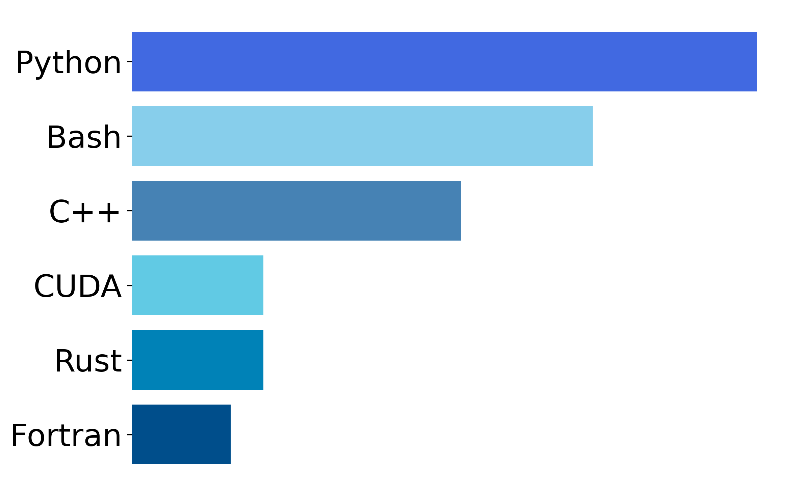

### Hola👋
<h3 align="center">

</h3>

- A quantum chemist by training, PhD alumnus of [Evangelista Lab](https://evangelistalab.org/).
- I worked on digital quantum simulation of molecules during my doctoral research, explore my dissertation ["Achieving quantum practicality via resource-efficient simulations of strongly correlated molecules on quantum computers"](https://etd.library.emory.edu/concern/etds/td96k398b?locale=it).
- I am a scientific software developer working on computer-aided drug discovery, with a focus on free energy calculations and crystal structure prediction.
- My favorite aspect of software developement is writing unit tests and doing code reviews!
- While Python is my mother tongue, I am passionate about exploring low-level programming languages to enhance the performance of Python-based applications.

    

